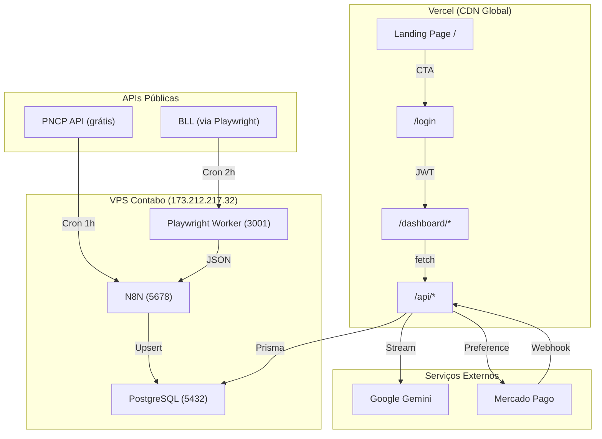

# Plano Completo — Performance Pregão: De Mock para Produção Real

## Comparação dos 3 Planos
| | Claude | GPT-5 | Gemini |
|---|---|---|---|
| **Forte** | Mapeou todos os botões/links com precisão line-by-line; identificou rename do env Gemini | Encontrou 20 issues; bug do admin ping; propôs KanbanBoard via props (mais limpo) | Visão macro clara; nota que Gemini API é grátis |
| **Abordagem Kanban** | Self-fetch interno | Props externas (pai controla) | Não detalhou |
| **Registro de usuários** | Incluir form de registro no login | Sem registro público (admin cria) | Não abordou |

**Decisão:** Adotar GPT-5 para Kanban via props (mais testável) + Claude para mapeamento de botões + registro público adiado (admin cria contas por agora).

---

## O Que Você Precisa Me Dar (API Keys)

| Chave | Para quê | Onde pegar | Paga? |
|---|---|---|---|
| `GOOGLE_GENERATIVE_AI_API_KEY` | Chat IA + Resumo de editais | https://aistudio.google.com/apikey | **GRÁTIS** (15 req/min, 1M tokens/dia) |
| `MP_ACCESS_TOKEN` | Checkout Mercado Pago | https://www.mercadopago.com.br/developers/panel/app | Só cobra comissão sobre vendas |
| `MP_WEBHOOK_SECRET` | Validar webhooks do MP | Gere qualquer string 32+ caracteres | Grátis |
| SMTP (host/user/pass) | Alertas por email (N8N) | Gmail App Password, SendGrid ou Resend | Grátis até certo volume |

### APIs Públicas Já Acessíveis (Sem Chave)
- **PNCP** — `https://pncp.gov.br/api/pncp/v1/contratacoes/publicacao` — 100% grátis, sem auth
- **PostgreSQL VPS** — `173.212.217.32:5432` — rodando, schema aplicado
- **N8N** — porta 5678 na VPS — rodando, precisa importar workflows
- **Playwright Worker** — porta 3001 na VPS — rodando (`/health` → OK)

---

## Mapa Completo de Botões e Links (Estado Atual → Estado Desejado)

### Landing Page (`/`)
| Botão/Link | Vai para | Status Atual | Correção |
|---|---|---|---|
| Nav "Entrar" | `/login` | **404** | Recriar login page |
| Nav "Começar Grátis" | `/login` | **404** | Recriar login page |
| Hero "Começar Agora" | `/login` | **404** | Recriar login page |
| Hero "Ver Demo" | `#como-funciona` | OK | — |
| Plano Free "Começar Grátis" | `/login` | **404** | Recriar login page |
| Plano Pro "Assinar PRO" | `/login` | **404** | Recriar login page |
| Plano Infinity "Assinar Infinity+" | `/login` | **404** | Recriar login page |
| CTA "Criar Conta Gratuita" | `/login` | **404** | Recriar login page |
| CTA "Falar com Especialista" | `mailto:contato@...` | OK | — |
| Footer "Termos de Uso" | `#` | Placeholder | Criar página ou alert |
| Footer "Privacidade" | `#` | Placeholder | Criar página ou alert |

### Dashboard Sidebar
| Link | Vai para | Status |
|---|---|---|
| Oportunidades | `/dashboard/opportunities` | OK (mas dados mock) |
| Negócios | `/dashboard/negocios` | OK (mas Kanban mock) |
| Análise | `/dashboard/analise` | OK (mas charts mock) |
| Jurídico | `/dashboard/juridico` | OK (coming soon) |
| Upgrade | `/dashboard/upgrade` | OK (MP checkout) |
| Admin (role-gated) | `/admin` | OK |
| Sair da conta | `signOut → /login` | **404** |

### Oportunidades (`/dashboard/opportunities`)
| Botão | Ação Atual | Ação Desejada |
|---|---|---|
| Input busca | Filtra mock local | `GET /api/biddings?search=...` |
| "Buscar" | `setTimeout` fake | `fetch /api/biddings` real |
| Filtro Portal | Mock local | Mapear para PortalType enum |
| Filtro Estado | Mock local | Query param `state` na API |
| Filtro Modalidade | Mock local | Query param `modality` na API |
| Filtro Valor mín | Mock local | Query param `minValue` na API |
| ⭐ Salvar | `console.log` | `POST /api/biddings/[id]/save` |
| "Ver Edital" | `console.log` | `router.push('/dashboard/bidding/[id]')` |
| Paginação | Array slice local | `page` param na API |

### Negócios / Kanban (`/dashboard/negocios`)
| Elemento | Atual | Desejado |
|---|---|---|
| Stats (4 cards) | Hardcoded `'5'`, `'2'`, `'1'`, `'1'` | Computado de `GET /api/saved` |
| Kanban cards | `INITIAL_ITEMS` mock | `GET /api/saved` real |
| Drag & drop | Só estado local | `PATCH /api/saved/[id]` persiste stage |
| Card "⋯" button | Nada | Abrir menu (editar notas, deletar) |
| Card bell icon | Nada | Configurar `alertAt` |
| Column "+" | Nada | Busca rápida para adicionar edital |

### Análise (`/dashboard/analise`)
| Elemento | Atual | Desejado |
|---|---|---|
| 4 stats cards | Todos hardcoded | `GET /api/analytics` com dados reais |
| Gráfico área "Disputas por Mês" | `monthlyData` fake | API real |
| Gráfico pizza "Status" | `statusData` fake | API real |
| Gráfico barra "Valor por Portal" | `portalData` fake | API real |

### Admin (`/admin`)
| Elemento | Atual | Desejado |
|---|---|---|
| 4 stats cards | `MOCK_STATS` | `GET /api/admin/metrics` |
| Link "Logs do Sistema" | `/admin/logs` **404** | Criar stub page |
| Link "IA & Modelos" | `/admin/ai` **404** | Criar stub/config page |
| Activity feed (6 items) | Hardcoded | Últimos 5 SavedBiddings reais |

---

## Plano de Execução (13 Steps)

### Step 1 — BLOCKER: Recriar Login Page
- **Criar:** `app/(auth)/layout.tsx` — layout mínimo centralizado
- **Criar:** `app/(auth)/login/page.tsx` — form com email/senha, `signIn('credentials')`, erro inline
- **Verificação:** `/login` renderiza. Login com `admin@performancepregao.online / Admin@2024!` redireciona para `/dashboard/opportunities`

### Step 2 — Corrigir 3 Bugs Críticos
- `app/api/webhooks/mercadopago/route.ts:45` — `MERCADOPAGO_ACCESS_TOKEN` → `MP_ACCESS_TOKEN`
- `app/api/biddings/route.ts:35` — `{ type: portal }` → `{ is: { type: portal } }`
- `.env.local` + `.env.example` — `GEMINI_API_KEY` → `GOOGLE_GENERATIVE_AI_API_KEY`

### Step 3 — Carregar Dados Reais via N8N
- Consultar IDs dos Portais no DB: `SELECT id, type FROM "Portal";`
- No N8N: importar `wf-01-pncp-sync.json`, substituir `PNCP_PORTAL_ID_PLACEHOLDER` pelo UUID real
- Importar os outros 3 workflows
- **Executar WF-01 manualmente** → editais reais do PNCP entram no PostgreSQL
- **Verificação:** `SELECT COUNT(*) FROM "Bidding"` → > 0

### Step 4 — Oportunidades: Dados Reais
- Remover `MOCK_BIDDINGS` inteiro (linhas 12-109)
- Substituir `handleSearch` por `fetch('/api/biddings?...')`
- Mapear portais display → enum: `{ 'Compras.gov': 'COMPRAS_GOV', ... }`
- `onView` → `router.push('/dashboard/bidding/' + id)`
- `onSave` → `POST /api/biddings/[id]/save`
- Cast `Number(b.estimatedValue)` (Prisma Decimal vem como string)

### Step 5 — Criar Página de Detalhe do Edital
- **Criar:** `app/dashboard/bidding/[id]/page.tsx`
- Fetch `GET /api/biddings/[id]` → header + dados + itens + valor + prazo
- Seção "Resumo IA" com streaming de `/api/ai/resume`
- Botão "Chat com IA" abre `ChatModal`
- Botão salvar/remover

### Step 6 — ChatModal: IA Real
- Remover `MOCK_RESPONSES` e `getResponse()`
- Adicionar prop `biddingId: string`
- Usar `useChat` de `ai/react` com `api: '/api/ai/chat'` e `body: { biddingId }`

### Step 7 — Kanban: Dados Reais
- Remover `INITIAL_ITEMS` do KanbanBoard
- Aceitar props `items` + `onStageChange(savedId, newStage)`
- `negocios/page.tsx` faz `GET /api/saved`, computa stats, passa props
- Drag-end → `PATCH /api/saved/[id]` → persiste no banco

### Step 8 — Análise: Dados Reais
- **Criar:** `app/api/analytics/route.ts` — aggregações por mês, stage, portal
- Remover 4 arrays mock do `analise/page.tsx`
- Fetch novo endpoint, alimentar Recharts

### Step 9 — Admin: Dados Reais
- Remover `MOCK_STATS` do `admin/page.tsx`
- Fetch `GET /api/admin/metrics`
- **Criar:** `app/admin/logs/page.tsx` (stub)
- **Criar:** `app/admin/ai/page.tsx` (config info)

### Step 10 — Header.tsx: Títulos Dinâmicos
- Adicionar `'/dashboard/bidding': 'Detalhes do Edital'` e `'/dashboard/upgrade': 'Upgrade'`
- Mudar lookup para `pathname.startsWith(path)`

### Step 11 — Configurar ENV Vars no Vercel
- Setar `GOOGLE_GENERATIVE_AI_API_KEY` (real, do user)
- Setar `MP_ACCESS_TOKEN` (real, do user)
- Setar `MP_WEBHOOK_SECRET`
- Setar `N8N_WEBHOOK_SECRET`

### Step 12 — Build + Deploy Final
- `npm run build` → 0 erros
- `git push origin main`
- `vercel --prod`

### Step 13 — Teste End-to-End
| Fluxo | Checklist |
|---|---|
| Landing → Login | `/login` renderiza, login funciona |
| Oportunidades | Editais reais do PNCP aparecem |
| Ver Edital | Detalhes + resumo IA streaming |
| Chat IA | Gemini responde com contexto do edital |
| Salvar edital | Toggle funciona, aparece no Kanban |
| Kanban | Drag persiste stage no refresh |
| Análise | Charts com dados reais |
| Admin | Métricas reais do banco |
| Upgrade | Checkout MP cria preferência |

---

## Fluxo de Dados

